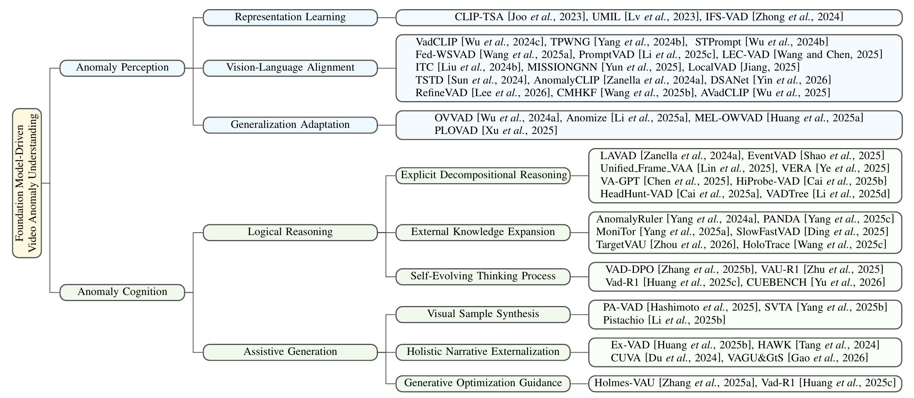

<h1 align="center">A Survey on Foundation Model-Driven Video Anomaly Understanding</h1>

## 🏠 About
This is the **systematic survey** of the **Foundation Model-driven Video Anomaly Understanding (VAU)** field. It includes two main parts: **Anomaly Perception** and **Anomaly Cognition** . The site provides a detailed taxonomy of existing methods, an overview of the unified perception-cognition framework, and the references cited in the paper. For each reference, we include its category, the link to the original paper, and code repository (if available).

<p align="center">
    
</p>

## 📃 More Information

- References and citation list: [reference.md](./reference.md)

## 🌐 Related works
- [Deep Learning for Video Anomaly Detection: A Review at TNNLS 2025](https://roc-ng.github.io/DeepVAD/)
- [Foundation Models in Visual Anomaly Detection: Advances, Challenges, and Applications at ICCV 2025](https://sites.google.com/view/iccv2025-tutorial-fm-driven-ad/home)

## 💻 License 
A Survey on Foundation Model-Driven Video Anomaly Understanding is released under the [MIT license](./LICENSE).

## 📍 Citation

If you find this project useful in your research, please consider citing:

```BibTeX
@inproceedings{su2026fm-vau,
  title={A Survey on Foundation Model-Driven Video Anomaly Understanding},
  author={Su, Wanshun and Tang, Ke and Wu, Peng and Yan, Qingsen and Pang, Guansong},
  year={2026}
}
```

## 👤 Contact
contact: `suws0616@gmail.com` and `akaketang@gmail.com` and `xdwupeng@gmail.com`. 
